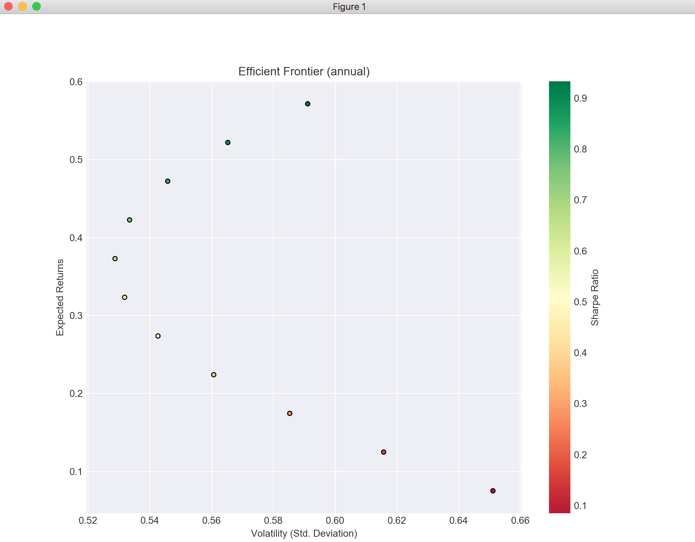

# MSCI 261 Project
#### Members
- Jerry Huang (20724528)
- Heng Lu (20748479)
- Hongru Xiang (20734454)


### Packages used
- python version: 2.7.15
- pandas-datareader: 0.7.0
- matplotlib: 2.2.4
- pandas: 0.24.2
- numpy: 1.16.4

## To run it
We used python 2.7.15 to run the script.
```bash
python2 project.py      # version 2.7.15
```
Stocks we inputted to construct portfolio: __COTY__, __XRX__.
```bash
# Enter the first stock name
Stock code name 1: COTY
# Enter the second stock name
Stock code name 2: XRX  
# We also let you to custom risk free rate. For part 2 in the project ouline enter 2%
Risk Free Rate (Annual) (in percentage form ex. 5.25%): 2%
``` 
__Note__: we have both ouput for monthly and annual, but they are all calculated using the same monthly data.
#### Output:
```
Minimum Variance Portfolio: 
        (monthly)
        MVP monthly proportion COTY: 41.029%
        MVP monthly proportion XRX: 58.971%
        MVP monthly standard deviation: 15.260%
        MVP monthly standard portfolio return: 2.512%

        (annual)
        MVP annual proportion COTY: 41.029%
        MVP annual proportion XRX: 58.971%
        MVP annual standard deviation: 52.864%
        MVP annual standard portfolio return: 36.788%

Case 1: 
        Given-Proportion invested in risk-free asset: 0%
        Given-Proportion invested in market portfolio: 100%

        (monthly)
        Maximum Sharpe ratio: 0.215
        Market portfolio proportion COTY: 0.000%
        Market portfolio proportion XRX: 100.000%
        Market monthly portfolio expected return: 3.839%
        Market monthly portfolio standard deviation: 17.064%

        (annual)
        Maximum Sharpe ratio: 0.933
        Market portfolio proportion COTY: 0.000%
        Market portfolio proportion XRX: 100.000%
        Market annual portfolio expected return: 57.151%
        Market annual portfolio standard deviation: 59.110%

Case 2: 
        Given-Proportion invested in risk-free asset: 50%
        Given-Proportion invested in market portfolio: 50%

        (monthly)
        Portfolio monthly expected return: 2.002%
        Portfolio monthly standard deviation: 8.532%

        (annual)
        Portfolio annual expected return: 29.576%
        Portfolio annual standard deviation: 29.555%

Case 3: 
        Given-Proportion invested in risk-free asset: -50%
        Given-Proportion invested in market portfolio: 150%

        (monthly)
        Portfolio monthly expected return: 5.676%
        Portfolio monthly standard deviation: 25.595%

        (annual)
        Portfolio annual expected return: 84.727%
        Portfolio annual standard deviation: 88.665%
```

##### Plot Shown:


### BONUS:

Stocks Used:

- AGG
- BND
- XBB.TO
- ZAG.TO
- SBUX

```
Stock code name: AGG
Enter a code for the next stock: BND   
Enter a code for the next stock: XBB.TO
Enter a code for the next stock: ZAG.TO
Enter a code for the next stock: SBUX
Enter a code for the next stock: done
```

```
Stock 0 (AGG):
	Return: 7.50139510466%
	Variance: 0.00137003782769
	Standard Deviation: 3.70140220415%

Stock 1 (BND):
	Return: 7.31562925762%
	Variance: 0.00126738385767
	Standard Deviation: 3.56003350781%

Stock 2 (XBB.TO):
	Return: 6.96220635499%
	Variance: 0.00147542539242
	Standard Deviation: 3.84112664776%

Stock 3 (ZAG.TO):
	Return: 6.31596514652%
	Variance: 0.00157260140676
	Standard Deviation: 3.96560387174%

Stock 4 (SBUX):
	Return: 67.119649212%
	Variance: 0.027628276071
	Standard Deviation: 16.6217556446%

Portfolio Risk: 3.84773303872%
Portfolio Return: 19.0429690152%
```
